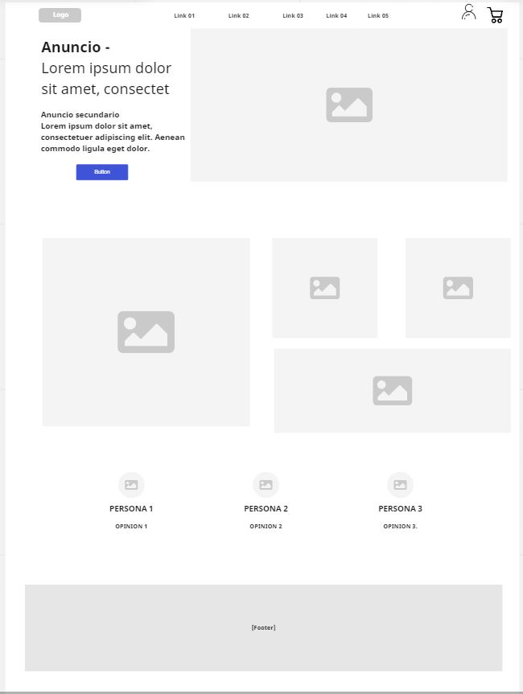

# Mi primero proyecto HTML/CSS

## Descripción basica
En este proyecto me enfoque en crear una *landing page* estática con el motivo de un comercio de venta de camaras de video.

## Tecnologías utilizadas
Para esta oportunidad y en pro de aprender a utilizar de mejor manera las etiquetas, atributos, media querys, etc; he optado por realizar mi *landing page* con codigo HTML y CSS puro, sin la utilización de *framework Bootstrap*.

## Mockup del sitio 

.

## Aprendizajes logrados
- Uso de HTML semantico estandar N°5.
- Uso de CSS para darle estilos al HTML.
- Aprendizaje uso de media querys para responsive.
- Creacion de repositorio en Github y control de versiones GIT
- Creacion de archivo Readme con extension MD para descripción

## Aprendizajes por mejorar
- Optimización de uso de etiquetas y anidación en el HTML.
- Selección de estilos multiples para las etiquetas, clases, etc.
- Optimización de los media querys para todos los elementos del sitio.
- Uso de elementos de diseño para decorar el Readme.md

## Conclusiones
Me pareció el proyecto muy interesante para darle uso a lo enseñado, si bien llevamos ya meses para avanzar en el proyecto tuve algunos problemas para organizar el trabajo y estudio así dedicarle mas practica a lo aprendido o solicitar algun consejo. Quedo conforme ya que me entretuvo e inició mi gusto y curiosidad por seguir aprendiendo de programación, muchas veces quedé pegado en algunos puntos pero logré solucionarlo de alguna forma. Sé que hay muchas cosas que podría optimizar en terminos esteticos pero por ser el primer protecto me parece aceptable. Seguimos !